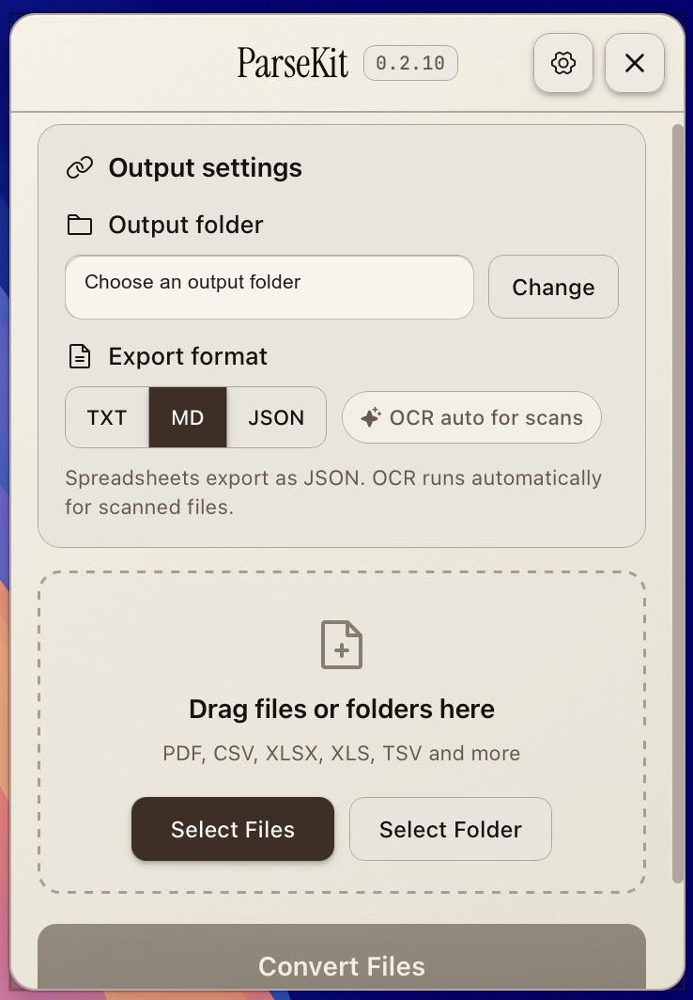
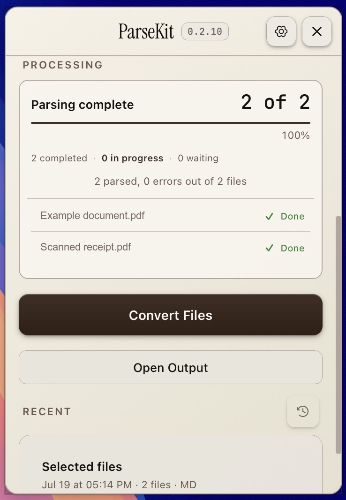
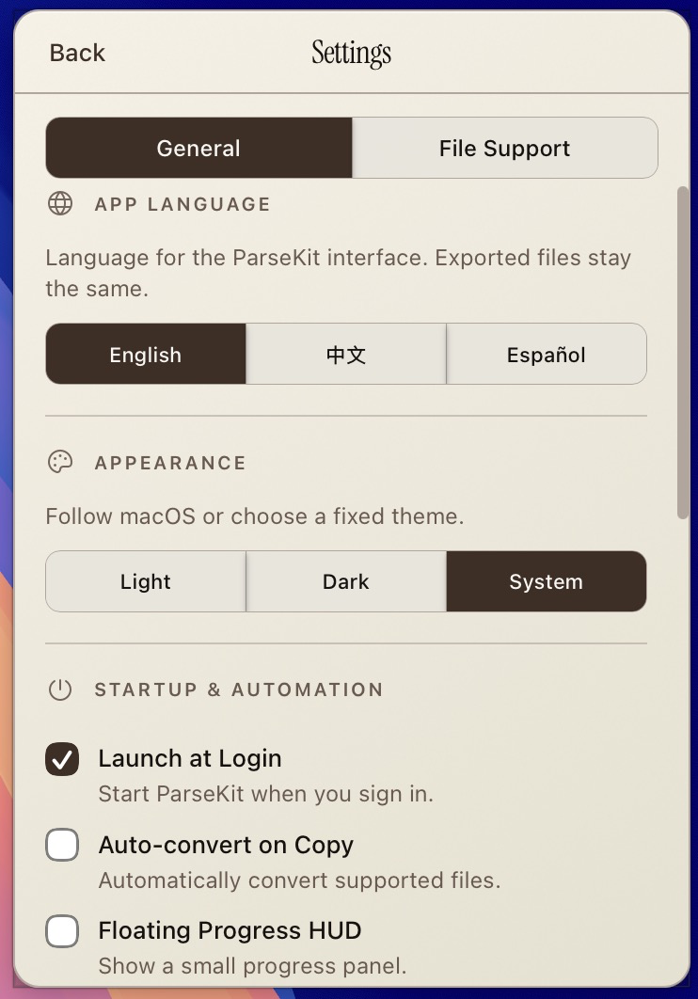
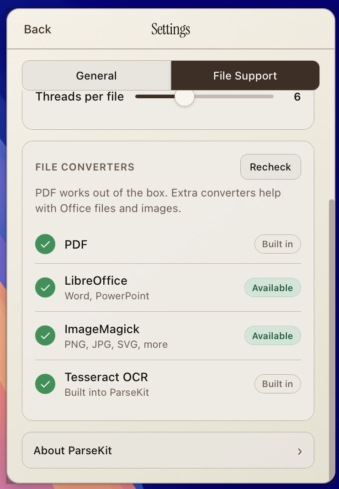

<p align="center">
  
</p>

<h1 align="center">ParseKit</h1>

<p align="center">
  <strong>Documents → clean Markdown, on your Mac.</strong><br>
  Menu bar · offline · no accounts · no API keys
</p>

<p align="center">
  <a href="https://github.com/harshabala/parsekit/releases/latest/download/ParseKit_0.2.11_aarch64.dmg"><strong>↓ Download for Mac (Apple Silicon)</strong></a>
  &nbsp;·&nbsp;
  <a href="docs/INSTALL.md">Install guide</a>
  &nbsp;·&nbsp;
  <a href="https://github.com/harshabala/parsekit/releases/latest">Releases</a>
</p>

## See it in action

<table>
  <tr>
    <td width="50%"><br><sub>Convert files locally</sub></td>
    <td width="50%"><br><sub>See completed batches</sub></td>
  </tr>
  <tr>
    <td width="50%"><br><sub>Make ParseKit yours</sub></td>
    <td width="50%"><br><sub>Check file support</sub></td>
  </tr>
</table>

---

## What it does

Drop PDFs, Word, Excel, PowerPoint, or images into the menu-bar app. ParseKit converts them **locally** to Markdown, plain text, or JSON — ready for ChatGPT, Claude, notes apps, or RAG pipelines.

Nothing is uploaded. Your files stay on your Mac.

| You get | Details |
| --- | --- |
| **Local conversion** | PDF, Office, images → `.md` / `.txt` / `.json` |
| **OCR** | Scanned pages become real text |
| **Finder Quick Action** | Right-click → Parse to Markdown |
| **Hotkey + clipboard** | Global shortcut (⌃⇧M) |
| **CLI** | `parsekit convert` for scripts and agents |
| **Updates** | In-app install when a new version ships |

PDF works out of the box. Word/PowerPoint need [LibreOffice](https://www.libreoffice.org/download/); images need ImageMagick (`brew install imagemagick`). Settings → File Support shows what’s missing.

## Install (1 minute)

1. [Download the DMG](https://github.com/harshabala/parsekit/releases/latest/download/ParseKit_0.2.11_aarch64.dmg)
2. Open it → drag **ParseKit** to **Applications**
3. Open from Applications → look for the icon in the **menu bar** (top right)

First launch may be blocked by Gatekeeper (the app isn’t notarized yet). Fix once:

```bash
xattr -cr /Applications/ParseKit.app
```

Or right-click → **Open**, or use **Settings → General → Copy fix command**. Full steps: [docs/INSTALL.md](docs/INSTALL.md).

## How people use it

- **Paste into AI** — convert a scan or contract, copy clean Markdown into Claude/ChatGPT  
- **Batch prep** — drop a folder of client docs, convert once, feed the output folder into a project or RAG index  
- **Agent workflow** — `parsekit convert spec.pdf --out /tmp/spec.md` before loading a PDF into context  

More: [skills/parsekit/SKILL.md](skills/parsekit/SKILL.md) · [AGENTS.md](AGENTS.md)

## Privacy

Files, OCR, and conversion never leave your Mac. No telemetry. Network only for optional app updates and first-time OCR language packs.

## Develop

```bash
git clone https://github.com/harshabala/parsekit.git
cd parsekit
npm install
npm run build:sidecar
npm run tauri dev
```

Release process: [docs/RELEASING.md](docs/RELEASING.md) · Benchmarks: [docs/benchmark-results.md](docs/benchmark-results.md)

## Credits

Created by [Harsha Balakrishnan](https://github.com/harshabala).  
Powered by [LiteParse](https://github.com/run-llama/liteparse) · [Tauri](https://tauri.app) · [Svelte](https://svelte.dev)  
License: [Apache-2.0](LICENSE)
