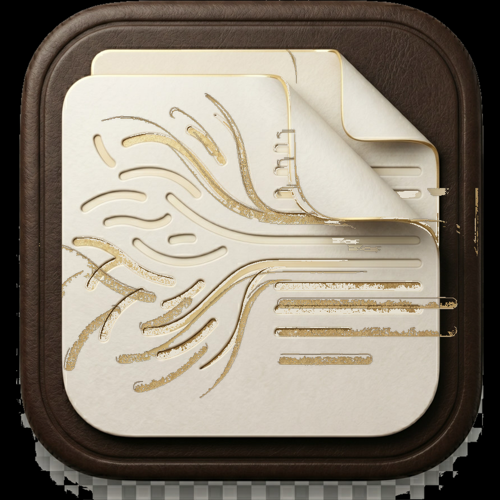
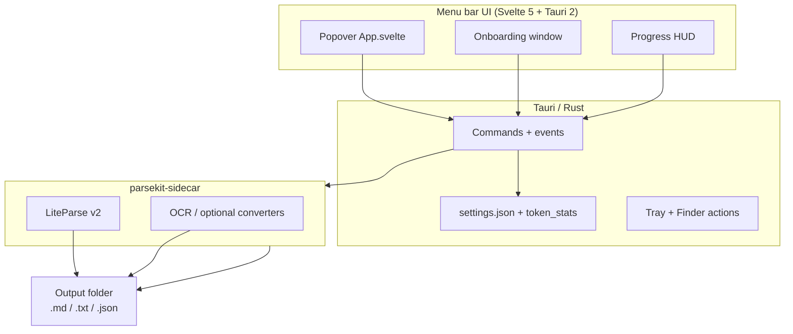

<p align="center">
  
</p>

<h1 align="center">ParseKit</h1>

<p align="center">
  <a href="https://github.com/harshabala/parsekit/releases/latest"><strong>Download for Mac</strong></a>
  &nbsp;·&nbsp;
  <a href="docs/INSTALL.md">Install guide</a>
</p>

---

## Start here

### What it is

ParseKit is a small app that lives in your Mac menu bar. You give it PDFs, Word files, spreadsheets, slides, or images — it turns them into clean Markdown (or plain text / JSON) **on your computer**.

### What problem it solves

Raw documents are messy for AI tools. They include headers, footers, and layout noise that waste tokens, and scans aren’t readable as text without OCR. ParseKit cleans that up **locally**, so you paste more useful content into ChatGPT, Claude, Gemini, or your notes — and private files never get uploaded for conversion.

### Install and first use (about 2 minutes)

1. Download the latest DMG from [Releases](https://github.com/harshabala/parsekit/releases/latest) (Apple Silicon, macOS 12+).
2. Open the DMG → drag **ParseKit** into **Applications**.
3. Open ParseKit from Applications. Look for the icon in the **menu bar** (top-right of the screen).
4. If macOS blocks the app, run once in Terminal (or use the fix command in Settings):

   ```bash
   xattr -cr /Applications/ParseKit.app
   ```

5. Click the menu bar icon → set an **output folder** if asked → **drop one PDF or Office file** → click convert.
6. When it finishes, you’ll see **tokens saved this batch**, plus **today** and **all-time** totals. Open the output folder and paste the Markdown into your AI tool or notes.

**Nothing is uploaded** for conversion. Counts stay on this Mac.

### When something goes wrong

| Situation | What to do |
|-----------|------------|
| Word/PowerPoint fails | Open **Settings → File Support** and install the listed helpers (e.g. LibreOffice). PDFs usually work without them. |
| Scan looks empty | Turn **OCR** on in Settings and pick a language. |
| Some files fail in a batch | The results panel shows success vs fail. Retry the failed ones or try another format. |
| App won’t open | Run the `xattr` command above; details in [docs/INSTALL.md](docs/INSTALL.md). |
| First launch feels unclear | Drop **one** file first — the token savings number is the “it worked” moment. |

### Privacy (plain words)

Your documents stay on your Mac. Token savings and success counts are stored only on this device. Optional: update checks and OCR language packs may use the network; conversion itself does not send your files to a server.

---

## For technical users

### Architecture



### How conversion works

1. UI collects paths + options (format, OCR, workers).
2. Sidecar streams events: `start` → `progress` → `token_savings` → `done` / `error`.
3. Frontend records **local** token stats and job outcomes; shows a **batch scoreboard** (this batch / today / all-time / success rate).
4. Files are written only under the user-chosen output directory.

### Product metrics (local-first)

| Metric | Definition | Storage |
|--------|------------|---------|
| **Activation** | `first_successful_convert_with_token_estimate` — first batch with ≥1 successful file | `activatedAt` in Tauri settings store |
| **Tokens saved** | Estimate: raw extract vs cleaned Markdown (~4 chars/token) | On-disk token stats (Rust `token_stats`) |
| **Today / all-time** | Calendar-day and lifetime sums of token events | Same |
| **Success rate** | Successful vs failed files across last 20 jobs | `jobOutcomesV1` in settings store (counts only) |
| **Destination (optional)** | Soft prompt after first success (Claude / ChatGPT / … / skip) | Local settings only |

**Privacy line on every stats surface:** *Stored only on this device. Never uploaded.*

See [`docs/TASKS.md`](docs/TASKS.md) for the PK-1…PK-5 checklist.

### Dev install & tests

```bash
npm ci
npm test
npm run check
npm run build
# Full app (needs sidecar build tooling):
npm run tauri:dev
```

CLI and agent skill: [AGENTS.md](AGENTS.md), [skills/parsekit/SKILL.md](skills/parsekit/SKILL.md).

### Benchmarks & honesty

Measured token comparisons: [`docs/benchmark-results.md`](docs/benchmark-results.md) via [`scripts/benchmark_tokens.py`](scripts/benchmark_tokens.py). Estimates are guides, not provider invoices.

---

## More detail

### Finder Quick Actions

Right-click a supported file → **Quick Actions → Parse to Markdown with ParseKit**. Install from **Settings → General → Finder**.

### Features

- Local-first conversion (files never leave the Mac for parsing)
- Menu bar native app (Tauri 2)
- Markdown, plain text, or JSON
- OCR for scans
- Finder Quick Actions + Services
- Global hotkey and clipboard helpers
- `parsekit` CLI for agents and scripts
- Local token savings + job success scoreboard
- Optional floating progress HUD

### Privacy (summary)

Conversion and OCR run locally. No conversion telemetry. Token and job counters are device-local. Optional network: app updates, OCR language data on first need.

### License

See [LICENSE](LICENSE) and [NOTICE.md](NOTICE.md).
